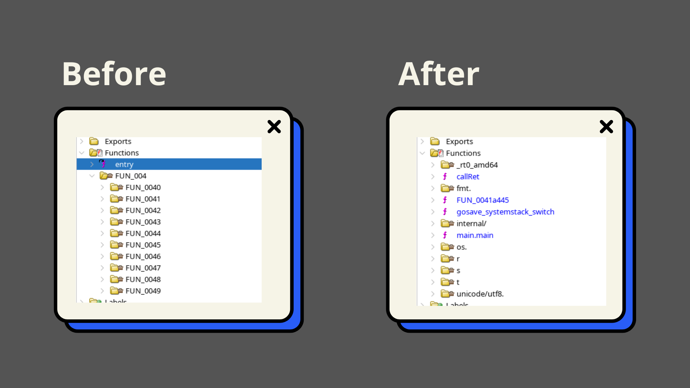

# ghidra-go-symbol-restore

A Jython script I wrote to retrieve symbols for Go versions >= 1.18. 
If you want to see how it works in depth, check out my blog post: [url]

No installation is required. The script:

- Tries to locates the `.gopclntab` section in the binary. 
- Parses the PC (Program Counter) and funcData offsets.
- Extracts the original function names.
- Cleans up special characters (to avoid Ghidra errors).
- Automatically renames the functions in Ghidra's symbol tree.

